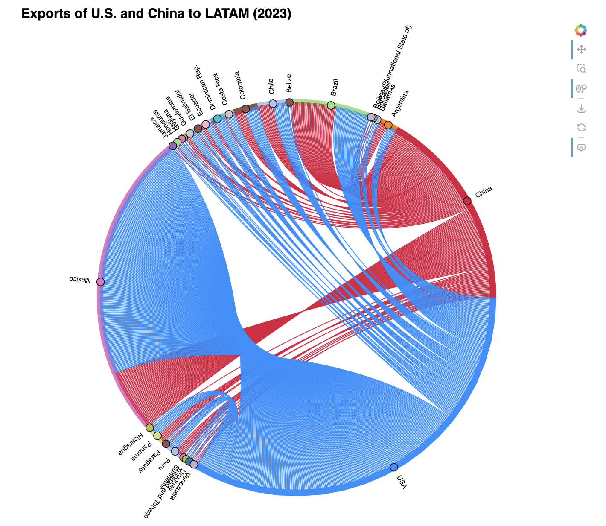

# Bilateral Trade Flows Between Latin America, China, and the United States Using UN COMTRADE API Data

## Overview

This project analyzes bilateral export flows between Latin American countries and their two main trading partners — **China** and the **United States** — using 2023 data from the **UN COMTRADE API**. A **network-based approach** is used to visualize the structure and intensity of trade relationships, represented through an interactive **chord diagram**. See the API documentation here: https://uncomtrade.org/docs/un-comtrade-api/.

## Key Features

- Bilateral trade flow analysis  
- Focus on Latin America, China, and the USA  
- Network visualization using `holoviews` and `bokeh`  
- Real-world trade data accessed via the UN COMTRADE API  
- Exportable as interactive HTML  

## Preview
### LATAM Exports to US and China


### LATAM Imports from US and China



## How It Works

The notebook performs the following steps:

1. Loads bilateral trade data for Latin American countries exporting to China and the USA.
2. Filters and transforms the data.
3. Maps countries to unique nodes.
4. Assigns custom colors to each node (with `crimson` for China and `dodgerblue` for the USA).
5. Generates an interactive **chord diagram** to visualize trade links.

## Technologies Used

- Python  
- [holoviews](https://holoviews.org/)  
- [hvplot](https://hvplot.holoviews.org/)  
- [bokeh](https://docs.bokeh.org/)  
- pandas  
- UN COMTRADE API  

## Installation

Install the required libraries with:

```bash
pip install holoviews hvplot bokeh pandas panel
